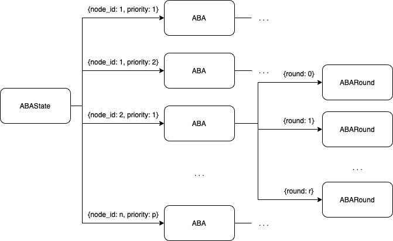

# Alea-BFT


Alea-BFT ([Alea-BFT arXiv](https://arxiv.org/abs/2202.02071)) protocol implementation in python3.


## The Protocol
----
Alea-BFT is an asynchronous byzantine fault tolerance protocol. Its major benefit is the quadratic communication complexity, against the cubic complexity of previous protocols. This is an important scalability upgrade from Alea-BFT which allows it to be applied in real world scenarios.

## Purpose
---
The purpose of this implementation is to test and take metrics of the original protocol and of variations of it.

## Usage
---
```console
python3 script.py N
```
where N is the number of nodes in the network.

## Files
---

### Scripts
1. script.py launches the network and runs the protocol. Log is created in the out{$i$}.txt file where $i$ is the number of the node. It receives one argument, the number of nodes to launch. E.g.
```console
python3 script.py 4
```
2. script_kill.py kills processes that are listening on the network ports. It receives the number of nodes of the network as input. E.g.:
```console
python3 script_kill.py 4
```
3. script_clear.py creates sockets that listen to the network ports. It receives the number of nodes of the network as input. E.g.:
```console
python3 script_clear.py 4
```
I've created the *script_clear.py* script to get data delivered to a socket but not treated on the previous execution, so that it won't interfer with the next script execution.

---

### VCBC State
1. **VCBCState** class:
- keep track of the (data,priority) received from other nodes.
2. **ReadyState** class:
- manage the VCBC Ready messages received.

### Broadcast component

A node will receive multiple data, each tagged with a certain priority, from other nodes.

Moreover, it will send data to other nodes and it needs to send a validation (VCBC Final) afte receiving a quorum of responses (VCBC Ready) from other nodes.

---

### ABA State


1. **ABAState** class:
- manages ABA executions with a map: {node id, priority} -> ABA and another map: node id -> priority (to keep track of the current priority of the ABA related to a node id).
2. **ABA** class:
- manages a single ABA execution with a map: round -> ABARound and the variables:

| Variable   | Definition |
| :----------: | :-----------: |
| finish     | map: node id -> vote|
| sentFinish | list of size 2 ([sent finish 0, sent finish 1])|
| round      | int (current round)|


3. **ABARound** class:
- manages a single round of an ABA execution. Has the following variables:

| Variable      | Definition |
| :-----------:   | :-----------: |
| init          | map: node id -> vote|
| sentInit      | list of size 2 ([sent init 0, sent init 1])|
| aux           | map: node id -> vote|
| sentAux       | list of size 2 ([sent init 0, sent init 1])|
| conf          | map: node id -> list of votes|
| sentConf      | bool (if sent conf)|

---

### Timer

An static class to help with the track of the execution time (latency) of protocol. Has the following two methods:
| Method           | Definition |
| -----------      | ----------- |
| startTimer(text) | take current time and associate with the label *text*|
| endTimer(text)   | return the difference between the current time and the time associated with the label *text* (in microseconds)|

---

### Coin

Single function coin: author, priority, round -> bit (0,1), to throw a coin for an ABARound.

---

## Node

Node class with the following methods:

### constructor(node_number,number_of_nodes) -> object
- set the node configuration and state
- set the network configuration
- start server
- connect to other nodes

### getSocket(node_number) -> socket:
- return socket for node_number

### getQuorum() -> int:
- return $2*f+1$ with $f=(n-1)//3$ and $n$ the number of nodes.

### getPartialQuorum() -> int:
- return $f+1$ with $f=(n-1)//3$ and $n$ the number of nodes.

### signal_handler(sig,frame) ->:
- gets SIGINT signal and calls self.close()

### close() ->:
- close server sockets and sockets connected to other node's servers.

### server() ->:
- creats a socket to listen for connection. Accept connection and calls self.handle_connection

### handle_connection(conn,addr) ->:
- call self.receive_message and self.process_message in a forever loop.

### receive_message(socket) -> message:
- read message from socket and returns it.


### process_message(message) ->:
- calls 'upon' function depending on the type of the message.


### send_message(message,socket,msg_type) ->:
- serialize message and send through socket.


### broadcast(message, msg_type) ->:
- calls self.send_message for all sockets connected to other nodes.


### StartVCBC(data) ->:
- creates a VCBC Send message, broadcasts and increments own priority.


### uponVCBCSend(message) ->:
- if hasn't the (data,priority) locally, add it. Sends VCBC Ready to the author.

### uponVCBCReady(message) ->:
- adds to ready_state. If has quorum, broadcasts VCBC Final.

### uponVCBCFinal(message) ->:
- stores VCBC Final message. If haven't sent ABA Init for this (author,priority), sends ABA Init with vote 1 and round 0.

### uponABAInit(message) ->:
- Check if it's old message.
- Add message.
- Return if have already sent AUX for this round and vote.
- If gets quorum, broadcasts AUX with vote.
- If gets partial quorum and never sent ABA Init, broadcasts it.

### uponABA(message) ->:
- Check if it's old message.
- Add message.
- Return if has already sent ABA Conf.
- If gets quorum, broadcasts ABA Conf.


### uponABAConf(message) ->:
- Check if it's old message.
- Add message.
- If gets quorum:
    - gets coin.
    - broadcasts ABA Init for next round (with coin vote with length of messages.votes == 2, else with vote in messages.votes)
    - if never sent ABA Finish, broadcasts ABA Finish if length of messages.votes == 1 and vote == coin.
    - increment round number

### uponABA(message) ->:
- Check if it's old message.
- Add message.
- If gets partial quorum for vote and never sent ABA Finish for this vote, broadcasts it.
- If gets quorum, set ABA as decided.


## Testing behavior
---
When the network is launched, only the node 1 starts a VCBC. After an ABA is completed, it starts the next VCBC after some delay.

Note that this is implemented to test latency instead of throughput.


## Roadmap:
---
- [X] Alea-BFT base implementation
- [ ] Threshold signture schema


